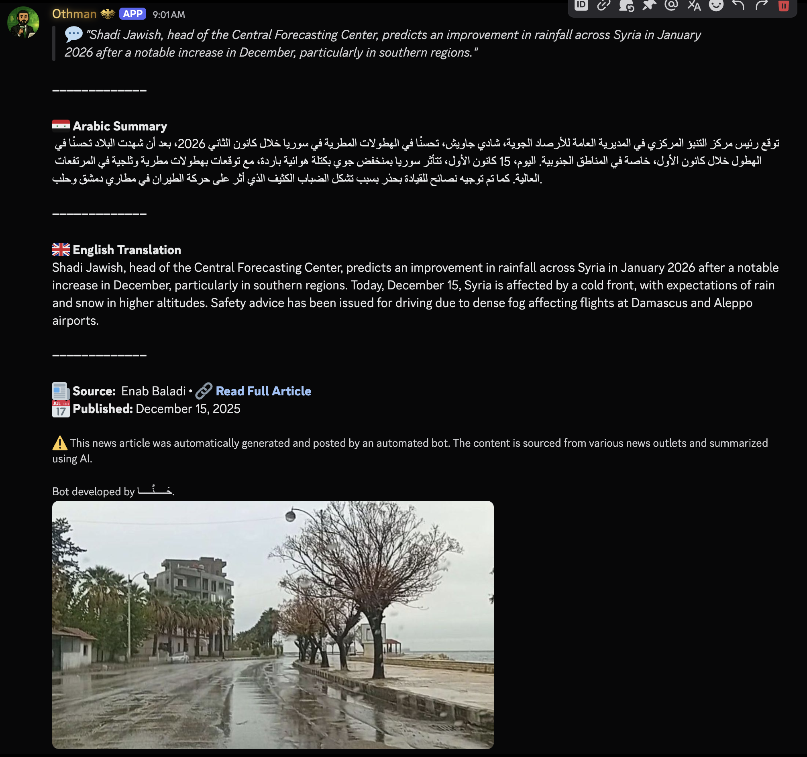
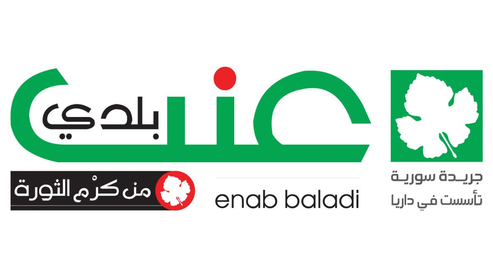

# OthmanBot

<div align="center">


**Automated News & Debates Bot for Discord**

*Built for [discord.gg/syria](https://discord.gg/syria)*

[](https://discord.gg/syria)
[](https://trippixn.com/othman)

</div>

---

## Overview

OthmanBot automates content posting and community engagement for Discord servers. It posts hourly news updates with AI-generated bilingual summaries and manages a debate forum with karma voting.

**Live Stats Dashboard**: [trippixn.com/othman](https://trippixn.com/othman)

> **Note**: This bot was custom-built for **discord.gg/syria** and is provided as-is for educational purposes. **No support will be provided.**

---

## Features

| Feature | Description |
|---------|-------------|
| **Content Automation** | 100% automated, runs 24/7 autonomously |
| **Bilingual Summaries** | AI-generated Arabic and English summaries |
| **Multi-Content** | News and Soccer on hourly rotation |
| **Forum Threads** | Auto-creates discussion threads with category tags |
| **Karma Voting** | Reaction-based upvote/downvote with persistent tracking |
| **Auto-Tagging** | AI detects relevant topic tags for new debates |
| **Hot Tag Manager** | Dynamic "Hot" tag based on activity |
| **Open Discussion** | Pinned casual chat thread (no karma tracking) |
| **Leaderboard** | Monthly/all-time rankings updated hourly |
| **Case Logging** | All ban/unban actions tracked per-user |
| **Appeal System** | Users can appeal disallows and closures via DM |
| **Stats Dashboard** | Real-time activity stats at [trippixn.com/othman](https://trippixn.com/othman) |

---

## Screenshots

<div align="center">
<table>
<tr>
<td align="center" width="50%">
<br>
<b>News Post</b><br>
<sub>AI-generated bilingual news summary with discussion thread</sub>
</td>
</tr>
</table>
</div>

---

## News Sources

<div align="center">
<table>
<tr>
<td align="center"><br><b>Enab Baladi</b><br><sub>Syrian News</sub></td>
<td align="center"><br><b>Koora</b><br><sub>Soccer News</sub></td>
</tr>
</table>
</div>

---

## Commands

| Command | Description |
|---------|-------------|
| `/karma [user]` | View karma stats for yourself or another user |
| `/disallow <user>` | Ban user from debates (moderator only) |
| `/allow <user>` | Unban user from debates (moderator only) |
| `/close [reason]` | Close the current debate thread (moderator only) |
| `/open` | Reopen a closed debate thread (moderator only) |
| `/rename <new_name>` | Rename a debate thread (moderator only) |
| `/cases [search]` | Search moderation cases by user or case ID (moderator only) |
| `/toggle` | Enable/disable bot posting (developer only) |

---

## Tech Stack

- **Python 3.12+** - Async runtime
- **Discord.py 2.7+** - Discord API wrapper
- **OpenAI GPT-4o-mini** - AI summaries
- **SQLite** - State persistence with WAL mode
- **aiohttp** - Async HTTP client
- **feedparser** - RSS scraping

---

## Architecture

```
OthmanBot/
├── src/
│   ├── core/           # Bot initialization, config, logging
│   ├── services/       # Scrapers, schedulers, debates system
│   ├── handlers/       # Event handlers (debates, reactions, ready)
│   ├── commands/       # Slash commands (/karma, /disallow, /allow, etc.)
│   ├── posting/        # Content posting logic
│   ├── views/          # Discord UI components
│   └── utils/          # Helpers, rate limiting, caching
├── data/               # SQLite database, backups
├── scripts/            # Deployment and maintenance scripts
└── images/             # Bot assets and examples
```

---

## Database Schema

| Table | Description |
|-------|-------------|
| `votes` | Individual vote records with karma tracking |
| `debate_participation` | User activity per thread |
| `debate_bans` | Ban records with expiry |
| `ban_history` | Historical record of all bans |
| `closure_history` | Thread closure records with reopen tracking |
| `case_logs` | Moderation case tracking per user |
| `appeals` | User appeals for disallows and closures |
| `open_discussion` | Open Discussion thread state |
| `audit_log` | All database changes for accountability |

---

## License

**Source Available** - See [LICENSE](LICENSE) for details.

This code is provided for **educational and viewing purposes only**. You may not run, redistribute, or create derivative works from this code.

---

<div align="center">


**OthmanBot**

*Built with care for [discord.gg/syria](https://discord.gg/syria)*

</div>
